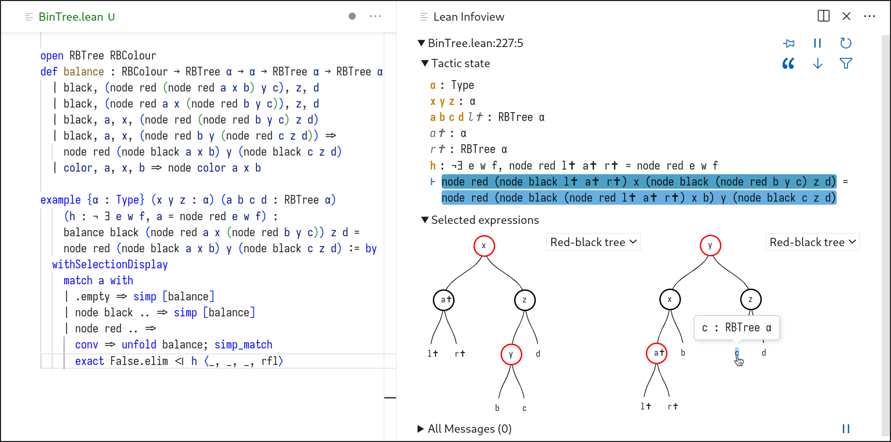

# ProofWidgets

ProofWidgets is a library of user interface components for [Lean 4](https://leanprover.github.io/). It
supports:
- symbolic visualizations of mathematical objects and data structures
- data visualization
- interfaces for tactics and tactic modes
- alternative and domain-specific goal state displays
- user interfaces for entering expressions and editing proofs

Authors: Wojciech Nawrocki, E.W.Ayers with contributions from Tomáš Skřivan

### How does ProofWidgets relate to user widgets?

ProofWidgets relies on the [user widgets](https://leanprover.github.io/lean4/doc/examples/widgets.lean.html)
mechanism built into Lean. User widgets provide the minimum of functionality needed to enable
custom user interfaces. ProofWidgets builds on top of this with a higher-level component library,
syntax sugar, and user-friendly abstractions. Stable parts of ProofWidgets may eventually be
backported into user widgets, but ProofWidgets overall is intended to be kept separate from Lean
core.

## Usage

### Viewing the demos

The easiest way to get started is to clone a **release tag** of ProofWidgets and run
`lake build :release`, as follows:

```bash
# You should replace v0.0.3 with the latest version published under Releases
git clone https://github.com/EdAyers/ProofWidgets4 --branch v0.0.3
cd ProofWidgets4/
lake build :release
```

After doing this you will hopefully be able to view the demos in `ProofWidgets/Demos/`. Top tip: use
the pushpin icon ()
to keep a widget in view. You can then live code your widgets.

### Using ProofWidgets as a dependency

Put this in your `lakefile.lean`, making sure to reference a **release tag** rather than the `main`
branch:
```lean
-- You should replace v0.0.3 with the latest version published under Releases
require proofwidgets from git "https://github.com/EdAyers/ProofWidgets4"@"v0.0.3"
```

Note that [developing ProofWidgets](#developing-proofwidgets) involves building TypeScript code with
NPM. When depending on `ProofWidgets` but not writing any custom TypeScript yourself, you likely
want to spare yourself or your users from having to run NPM. To support this, ProofWidgets is
configured to use Lake's [cloud releases](https://github.com/leanprover/lake/#cloud-releases)
feature which will automatically fetch pre-built JavaScript files *as long as* you require a release
tag rather than our `main` branch.

### Developing ProofWidgets

Contributions are welcome!

You must have NPM installed (it is part of Node.js). Run `lake build` to build the TypeScript UI
code as well as all Lean modules. Run `lake build widgetJsAll` to just build the TypeScript. Run
`lake build widgetJsAllDev` to build development versions of widgets which are easier to inspect
in developer tools. Outputs of `npm` are not shown by default - use `lake build -v [target]`
to see them.

⚠️ We use the `include_str` term elaborator to splice the JavaScript produced by `tsc` into our Lean
files. The JS is stored in `build/js/`. Note however that due to Lake issue [#86](https://github.com/leanprover/lake/issues/86),
rebuilding the `.js` will *not* rebuild the Lean file that includes it. To ensure freshness you may
have to resort to hacks such as removing `build/lib/` (this contains the `.olean`s) or adding a
random comment in the Lean file that uses `include_str` in order to ensure it gets rebuilt.
Alternatively, you can run `lake clean` to delete the entire build directory.

## Features



### JSX-like syntax

```lean
import ProofWidgets.Component.HtmlDisplay
open scoped ProofWidgets.Jsx

-- click on the line below to see it in your infoview!
#html <b>You can use HTML in lean! {toString <| 1 + 2>}</b>
```

See the `Jsx.lean` and `ExprPresentation.lean` demos.

### `json%` syntax

JSON-like syntax. Invoke with `json%`, escape with `$( _ )`

```lean
import ProofWidgets.Data.Json
open scoped ProofWidgets.Json

#eval json% {
  hello : "world",
  cheese : ["edam", "cheddar", {kind : "spicy", rank : 100.2}],
  lemonCount : 100e30,
  isCool : true,
  isBug : null,
  lookACalc: $(23 + 54 * 2)
}
```

### Support for libraries

We have good support for building diagrams with [Penrose](https://penrose.cs.cmu.edu/), and expose
some [Recharts](https://recharts.org/en-US/) components for plotting functions and other kinds of
data. See the `Venn.lean` and `Plot.lean` demos.

For more purpose-specific integrations of libraries see the `Rubiks.lean` and `RbTree.lean` demos.

### Custom `Expr` displays

Just like delaborators and unexpanders allow you to customize how expressions are displayed as text,
ProofWidgets allows "delaborating" into (potentially interactive) HTML. See the
`ExprPresentation.lean` demo.

### Multi-stage interactions

Proof widgets can be used to create proving loops involving user interactions and running tactics
in the background. See the `LazyComputation.lean` demo, and the `Conv.lean` demo for an example of
editing the proof script.

### Animated HTML

As a hidden feature, you can also make animated widgets using the `AnimatedHtml` component. This
works particularly well with libraries that ease between different plots, for example Recharts.
You can see an example of how to do this in the `Plot.lean` demo.
